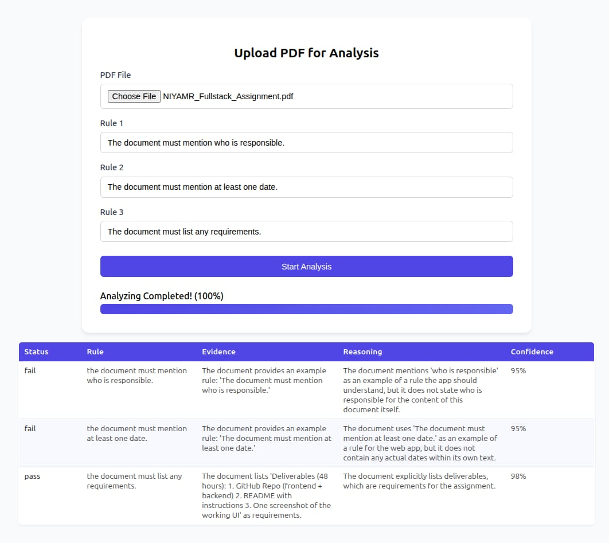

# PDF Document Analyzer

A web application that analyzes PDF documents against user-defined rules using LLM-powered validation. Upload any PDF document, specify up to 3 rules, and receive structured analysis results with evidence, reasoning, and confidence scores.

## Screenshot of the Application


## 🚀 Features

- **PDF Upload**: Upload any PDF document (2-10 pages, max 5MB)
- **Rule-Based Validation**: Define up to 3 custom rules in natural language
- **LLM-Powered Analysis**: Uses Google Gemini AI for intelligent document validation
- **Smart Text Extraction**: Extracts text using `unpdf` library with OCR fallback for scanned documents
- **Structured Results**: Returns PASS/FAIL status with evidence, reasoning, and confidence scores (0-100)
- **Real-time Progress**: Server-Sent Events (SSE) for live analysis updates
- **Docker Support**: Containerized Tesseract OCR server for handling scanned PDFs

## 🎯 How It Works

1. **Upload PDF**: User uploads a PDF document (2-10 pages) through the web interface
2. **Define Rules**: User enters up to 3 rules in natural language (e.g., "Document must mention a date")
3. **Text Extraction**: System extracts text using `unpdf` library, with OCR fallback for scanned documents
4. **LLM Analysis**: Extracted text and rules are sent to Google Gemini AI for validation
5. **Get Results**: For each rule, receive:
   - **Status**: PASS or FAIL
   - **Evidence**: Specific text snippet from the document with page reference
   - **Reasoning**: Brief explanation of the decision
   - **Confidence**: Score from 0-100

## 📋 Example Rule Validation

**Input Rules:**
- "The document must have a purpose section"
- "The document must mention at least one date"
- "The document must define at least one term"

**Output Format:**
```json
{
  "rule": "Document must mention a date",
  "status": "pass",
  "evidence": "Found on page 1: 'Published 2024-07-01'",
  "reasoning": "Document explicitly contains a date string",
  "confidence": 95
}
```

## 📋 Prerequisites

- **Node.js** v20 or higher
- **Docker** and **Docker Compose**
- **pnpm** package manager (v10.18.3 or higher)
- **Google Gemini API Key** ([Get one here](https://makersuite.google.com/app/apikey))

## 🔧 Installation

### Option 1: Docker Compose (Recommended)

1. **Clone the repository**
   ```bash
   git clone https://github.com/Sanjoy9999/NIYAMR_Fullstack_Assignment-Pdf-Analyzer.git
   cd NIYAMR_Fullstack_Assignment-Pdf-Analyzer
   ```

2. **Set up environment variables**
   ```bash
   cd server
   cp .env.example .env
   ```
   
   Edit `.env` and add your Google Gemini API key:
   ```env
   PORT=3000
   TESSERACT_API=http://tesseract:8884/tesseract
   GEMINI_API_KEY=your_gemini_api_key_here
   TEXT_THRESHOLD=100
   OCR_TIMEOUT_MS=120000
   ```

3. **Start the services**
   ```bash
   cd ..
   docker-compose up -d
   ```

4. **Access the application**
   - Open your browser and navigate to: `http://localhost:3000`

### Option 2: Manual Setup

1. **Clone the repository**
   ```bash
   git clone https://github.com/Sanjoy9999/Pdf-Analyzer--NIYAMR_Fullstack_Assignment.git
   cd Pdf-Analyzer--NIYAMR_Fullstack_Assignment/server
   ```

2. **Install dependencies**
   ```bash
   npm install -g pnpm
   pnpm install
   ```

3. **Set up environment variables**
   ```bash
   cp .env.example .env
   # Edit .env with your configuration
   ```

4. **Start Tesseract OCR server separately**
   ```bash
   docker run -d -p 8884:8884 hertzg/tesseract-server:latest
   ```

5. **Start the application**
   ```bash
   pnpm run dev
   ```

## 🎯 Usage

### Web Interface

1. Navigate to `http://localhost:3000`
2. Upload a PDF file (2-10 pages, max 5MB)
3. Enter up to 3 rules to validate (e.g., "Document must mention a date")
4. Click "Analyze" and watch real-time progress
5. View structured results with PASS/FAIL status, evidence, reasoning, and confidence scores

### Example Rules

- "The document must have a purpose section"
- "The document must mention at least one date"
- "The document must define at least one term"
- "The document must mention who is responsible"
- "The document must list any requirements"

### API Endpoints

#### 1. Analyze PDF Document

**POST** `/api/pdf-analyze`

Upload a PDF file and specify rules for analysis.

**Request:**
```bash
curl -X POST http://localhost:3000/api/pdf-analyze \
  -F "file=@resume.pdf" \
  -F 'rules=["Must contain contact information", "Should mention at least 2 years of experience", "Must include education details"]'
```

**Response:**
```json
{
  "statusCode": 200,
  "message": "PDF analysis started",
  "data": {
    "fileName": "resume.pdf",
    "analysisId": "1234567890"
  },
  "success": true
}
```

#### 2. Get Analysis Status (Server-Sent Events)

**GET** `/api/pdf-analyze/status/:id`

Stream real-time progress updates for an ongoing analysis.

**Request:**
```bash
curl -N http://localhost:3000/api/pdf-analyze/status/1234567890
```

**Response Stream:**
```
data: {"status":"Starting analysis...","progress":0}

data: {"status":"Reading document...","progress":30}

data: {"status":"Checking Rules...","progress":80}

data: {"status":"Analyzing Completed!","progress":100,"data":[...]}
```

#### 3. Health Check

**GET** `/health`

Check if the server is running.

**Response:**
```json
{
  "status": "OK"
}
```

### Input Rules

Rules should be provided as an array of natural language statements:

```json
[
  "The document must have a purpose section",
  "The document must mention at least one date",
  "The document must define at least one term"
]
```

### Output Schema

Each rule is analyzed and returns a structured result:

```json
{
  "rule": "Document must mention a date",
  "status": "pass",
  "evidence": "Found on page 1: 'Published 2024-07-01'",
  "reasoning": "Document explicitly contains a date string",
  "confidence": 95
}
```

**Field Descriptions:**

- `rule`: The original rule being checked
- `status`: Either "pass" or "fail"
- `evidence`: Specific text found in the document with page reference
- `reasoning`: 1-2 sentence explanation of the decision
- `confidence`: Integer from 0-100 indicating certainty level

## 🐳 Docker Configuration

The project uses Docker Compose with two services:

### Tesseract OCR Service
- **Image**: `hertzg/tesseract-server:latest`
- **Port**: 8884
- **Purpose**: OCR text extraction from scanned documents

### Backend Service
- **Base Image**: Node.js 20
- **Port**: 3000
- **Features**: 
  - Hot reload with nodemon
  - Volume mounting for development
  - Health checks
  - Automatic dependency installation

### Docker Commands

```bash
# Start all services
docker-compose up -d

# View logs
docker-compose logs -f

# Stop all services
docker-compose down

# Rebuild after code changes
docker-compose up -d --build
```

## 📁 Project Structure

```
NIYAMR_Fullstack_Assignment-Pdf-Analyzer/
├── docker-compose.yml          # Docker orchestration configuration
├── README.md                   # This file
└── server/
    ├── Dockerfile              # Server container definition
    ├── package.json            # Node.js dependencies
    ├── .env.example            # Environment variables template
    ├── index.js                # Application entry point
    ├── app.js                  # Express app configuration
    ├── config.js               # Environment configuration loader
    ├── controllers/
    │   └── pdfAnalyze.controller.js  # Main analysis logic
    ├── services/
    │   └── pdf.service.js      # PDF processing & AI services
    ├── routers/
    │   └── pdfAnalyze.route.js # API route definitions
    ├── middlewares/
    │   └── upload.middleware.js # File upload handling
    ├── utils/
    │   ├── ApiError.js         # Error handling utility
    │   ├── ApiResponse.js      # Response formatting utility
    │   └── asyncHandler.js     # Async error wrapper
    ├── state/
    │   └── progress.js         # Progress tracking state
    ├── public/
    │   ├── index.html          # Web interface
    │   └── app.js              # Client-side JavaScript
    └── uploads/                # Temporary file storage
```

## 🔧 Configuration

### Environment Variables

| Variable | Description | Default | Required |
|----------|-------------|---------|----------|
| `PORT` | Server port | `3000` | No |
| `TESSERACT_API` | Tesseract OCR endpoint | `http://localhost:8884/tesseract` | Yes |
| `GEMINI_API_KEY` | Google Gemini API key | - | Yes |
| `TEXT_THRESHOLD` | Min text length before OCR | `100` | No |
| `OCR_TIMEOUT_MS` | OCR request timeout | `120000` | No |

### File Upload Limits

- **Max file size**: 5MB
- **Allowed format**: PDF only
- **Temporary storage**: Files are automatically deleted after analysis

## 🛠️ Technology Stack

### Backend
- **Express.js 5.1.0** - Web framework
- **Node.js 20** - Runtime environment
- **multer 2.0.2** - File upload handling

### PDF Processing
- **unpdf 1.4.0** - PDF text extraction
- **pdf-lib 1.17.1** - PDF manipulation
- **@napi-rs/canvas 0.1.82** - Image rendering for OCR

### AI & OCR
- **@google/genai 1.30.0** - Google Gemini AI integration
- **Tesseract OCR** - Text recognition for scanned documents

### Additional Libraries
- **axios 1.13.2** - HTTP client
- **cors 2.8.5** - Cross-origin resource sharing
- **dotenv 17.2.3** - Environment configuration

## 🔍 Technical Implementation

### Text Extraction Process

1. **Primary Extraction**: Uses `unpdf` library to extract text from PDF documents
2. **OCR Fallback**: If extracted text is below threshold (default 100 chars):
   - Splits PDF into individual pages using `pdf-lib`
   - Renders each page as an image using `@napi-rs/canvas`
   - Sends images to Tesseract OCR server
   - Combines OCR results from all pages
3. **LLM Validation**: Sends extracted text and rules to Google Gemini AI
4. **Result Formatting**: Parses AI response into structured JSON format
5. **Progress Updates**: Provides real-time updates via Server-Sent Events

## 📝 Development

### Running in Development Mode

```bash
cd server
pnpm run dev
```

This starts the server with nodemon for automatic restarts on file changes.

### Testing the Application

```bash
# Test with a sample PDF
curl -X POST http://localhost:3000/api/pdf-analyze \
  -F "file=@document.pdf" \
  -F 'rules=["Must contain a date", "Must have a purpose section"]'
```

## 🛠️ Technology Stack

**Frontend:**

- HTML5, CSS3, JavaScript (ES6+)
- Server-Sent Events (SSE) for real-time updates

**Backend:**

- Express.js 5.1.0 - Web framework
- Node.js 20 - Runtime environment
- multer 2.0.2 - File upload handling

**PDF Processing:**

- unpdf 1.4.0 - PDF text extraction
- pdf-lib 1.17.1 - PDF manipulation
- @napi-rs/canvas 0.1.82 - Image rendering for OCR

**AI & OCR:**

- @google/genai 1.30.0 - Google Gemini AI integration
- Tesseract OCR - Text recognition for scanned documents

**Additional Libraries:**

- axios 1.13.2 - HTTP client
- cors 2.8.5 - Cross-origin resource sharing
- dotenv 17.2.3 - Environment configuration

